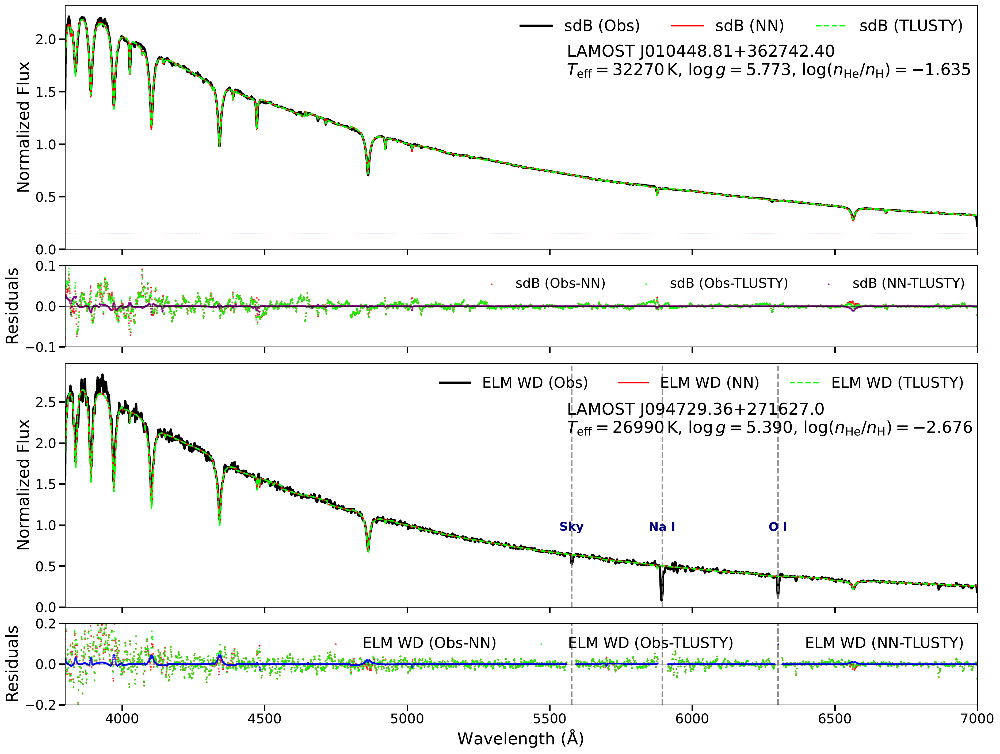

# TLUSTY NN
Neural Network for fast prediction of TLUSTY stellar atmosphere models.




Given three stellar parameters — effective temperature (Teff), surface gravity (logg), and helium abundance (log(n_He / n_H)) — the network predicts the full 50-layer atmospheric structure, including temperature, electron density, mass density, and 55 level populations, in under one second.


## Installation

### Prerequisites

- **Fortran compiler**: The underlying TLUSTY code is written in Fortran, so a Fortran compiler is required.
  - On **Ubuntu / Debian**: `sudo apt-get install gfortran`
  - On **macOS**: `brew install gcc`
  - On other systems, install `gfortran` via your package manager.

### Clone the repository

```bash
git clone https://github.com/JqRambo/tlustynn.git
cd tlustynn
```

### Install TLUSTY (optional)

If you do not already have TLUSTY installed locally, run `install_tlusty.py` to automatically download, configure, and compile the TLUSTY Fortran package:

```bash
# Default installation path: /home/ubuntu/tlusty
python install_tlusty.py

# Or specify a custom installation path
python install_tlusty.py /path/to/tlusty
```

The script will:

1. Check for `gfortran`
2. Download the required TLUSTY packages from the official website
3. Extract them to the specified directory
4. Set environment variables in your `~/.bashrc` (`TL208`, `TLUSTY`, `LINELIST`, `IRON`, `OPTABLES`)
5. Compile the TLUSTY and SYNSPEC executables
6. Run basic tests

After installation, reload your shell configuration:

```bash
source ~/.bashrc
```

### Important Notes

Please note that this code has not been peer-reviewed.  

> If you intend to use it, please contact the author, Dr. Jiao Li (lijiao@nao.cas.cn).  

> The pretrained model weight (`best_model.pt`, ~1 GB) exceeds GitHub's file-size limit and is therefore **not included** in this repository.
  Please reach out to Dr. Qi Jia (jq.physics@hotmail.com) to request access, and place the file in `tlustynn/checkpoints/`.
  Alternatively, you can train your own model with `run.py` (see below).

## Install into your Python environment

```bash
pip install .
```

After installation the package is available in `site-packages` and can be imported from anywhere:

```python
import tlustynn
```


## Quick Start

A ready-to-use example script is provided in **`basic.py`**.

### Predict a single atmosphere model

```python
from tlustynn import predict_atmosphere

# Predict and save as CSV
df, csv_path = predict_atmosphere(
    teff=10000,      # Effective temperature [K]
    logg=3.7,        # Surface gravity [log10(cm/s^2)]
    log_he_h=0.0,    # Helium abundance log(n_He/n_H) [dex]
    output_dir="./predictions",
    output_format='csv'   # Save as CSV file
)

print(f"CSV saved to: {csv_path}")   # → .../predictions/10000_3.7_0.0.csv
print(f"DataFrame shape: {df.shape}")  # (50, 58) → 50 depths × 58 parameters
```

The default file names follow the format **`{teff}_{logg}_{log_he_h}.csv`** and **`{teff}_{logg}_{log_he_h}.7`**.

### Predict and save as TLUSTY .7 format (fort.7)

```python
df, seven_path = predict_atmosphere(
    teff=10000,
    logg=3.7,
    log_he_h=0.0,
    output_dir="./predictions",
    output_format='7'     # Save as .7 file
)

print(f".7 file saved to: {seven_path}")  # → .../predictions/10000_3.7_0.0.7
```

### Create TLUSTY input file (.5 format)

```python
from tlustynn import create_ff_model

# Generate a TLUSTY input model file (fort.5 format)
create_ff_model(
    output_dir='/path/to/workdir',
    teff=10000,
    logg=3.7,
    log_he_h=0.0,
    lte_flag='F',
    ltgray_flag='F',
    nstmode='nst',
    frequency=2000,
    natoms_num=8
)
```


### Synthesize a spectrum

After predicting the atmosphere model, you can directly call **SYNSPEC** through the high-level API to synthesize a synthetic spectrum for a given wavelength range.

```python
from tlustynn import synthesize_spectrum

# Synthesize a H/He spectrum and save as CSV
synthesize_spectrum(
    teff=45000,        # Effective temperature [K]
    logg=4.0,          # Surface gravity
    log_he_h=0.0,      # Helium abundance log(n_He/n_H) [dex]
    spec_dir="./spec", # Working directory for TLUSTY/SYNSPEC I/O
    down=3600,         # Lower wavelength bound [Å]
    up=7500,           # Upper wavelength bound [Å]
    res=0.1,           # Wavelength step [Å]
    format="csv"       # Output format: "csv" or "fits"
)
```

`synthesize_spectrum` has no return value; the spectrum is written to the working directory
(`{teff}_{logg}_{log_he_h}.spec` raw output, plus `.csv`/`.fits` as requested).
Set `plot=True` to additionally generate a `spec.pdf` figure in the same directory.

**What happens under the hood**

1. Generates the TLUSTY input model (`fort.5`) via `create_ff_model()`.
2. Predicts the 50-layer atmosphere and writes it in TLUSTY `.7` format.
3. Creates the SYNSPEC control file (`fort.55.lin`).
4. Runs the SYNSPEC executable (`$TLUSTY/RSynspec`).
5. Reads the raw spectrum, converts it to the requested format (CSV or FITS), and optionally plots it.

> **Prerequisite**: TLUSTY must be installed and the environment variable `$TLUSTY` must point to the installation directory (see [Installation](#installation) above).


##  Output formats

### CSV format

The output CSV follows exactly the same column order as the original `hhe.csv` training data:

| Column | Description |
|--------|-------------|
| `teff` | Effective temperature [K] (replicated for all 50 rows) |
| `logg` | Surface gravity (replicated) |
| `log_he_h` | Helium abundance log(n_He/n_H) [dex] (replicated) |
| `M`    | Mass depth [g/cm²] (average profile in physical units) |
| `T`    | Temperature [K] |
| `ne`   | Electron number density [cm⁻³] |
| `rho`  | Mass density [g/cm³] |
| `level_1` … `level_55` | Level populations |

Each file contains **50 rows**, one per atmospheric depth layer.

### TLUSTY `.7` format

The `.7` file is a plain-text model atmosphere in the standard TLUSTY `fort.7` format (identical to `FF.7`):

```
   50   58
 3.339578E-07 5.245317E-07 8.231387E-07 ...
 ...
   1.812165E+04   8.381594E+10   1.910841E-13   7.939990E+05 ...
```

- **Line 1**: `n_depth` (50) and `n_params` (58)
- **Next lines**: mass-depth `M` values, 6 per line
- **Remaining lines**: for each depth, the 58 parameters (`T`, `ne`, `rho`, `level_1` … `level_55`), 5 per line

---


## Training your own model

If you have your own grid of converged TLUSTY models, you can train your own emulator with the `tlustynn.run` module:

```bash
python -m tlustynn.run --csv my_models.csv --epochs 1000
# Resume from a checkpoint:
python -m tlustynn.run --csv my_models.csv --resume checkpoints/best_model.pt
```

The dataset CSV must contain one row per depth layer (50 layers per model) with the columns:

```
teff, logg, log_he_h, M, T, ne, rho, level_1, ..., level_N
```

i.e. the three stellar parameters, the mass depth `M` (first data block of the TLUSTY `.7` file), and the target quantities. See the header of `tlustynn/run.py` for details.

Trained checkpoints (`best_model.pt`, `stats.json`, `avg_mass_physical.npy`, ...) will be saved to `./checkpoints/` by default (override with `--save_dir`).

---

## Repository structure

```
tlustynn/
├── tlustynn/                 # Main Python package
│   ├── __init__.py
│   ├── api.py                # User-facing predict_atmosphere() & synthesize_spectrum() API
│   ├── model.py              # TLUSTYNN network definition
│   ├── predict.py            # TlustyPredictor (model loading & inference)
│   ├── data_loader.py        # Dataset & preprocessing
│   ├── train.py              # Trainer class
│   ├── run.py                # Training entry point for custom datasets
│   ├── evaluate.py           # Evaluation & plotting entry point
│   ├── utils.py              # Plotting utilities
│   └── checkpoints/          # stats.json & avg_mass_physical.npy
│                             # (best_model.pt not included, see Important Notes)
├── basic.py                  # Usage examples (predict / synthesize)
├── install_tlusty.py         # TLUSTY Fortran package installer
├── setup.py
├── pyproject.toml
├── requirements.txt
└── README.md
```

---

## Requirements

- Python ≥ 3.9
- PyTorch ≥ 2.0
- NumPy, Pandas, scikit-learn, Matplotlib, tqdm, astropy

All dependencies are listed in `requirements.txt` and will be installed automatically with `pip install`.
---

## Applicability Range

The neural network model is trained and validated within the following stellar parameter ranges:

| Parameter | Symbol | Range | Units |
|-----------|--------|-------|-------|
| Effective temperature | `Teff` | 10,000 – 100,000 | K |
| Surface gravity | `logg` | 1.5 – 10.0 | log10(cm/s²) |
| Helium abundance | `log(n_He / n_H)` | -4.0 – 0.0 | dex |

## Notes

- **Extrapolation warning**: Predictions made outside the above ranges may be physically inaccurate or unreliable. The network has not been trained on data beyond these bounds.
- **Helium abundance**: The helium abundance is specified as `log_he_h = log(n_He/n_H)` in dex (0.0 corresponds to the solar value).
- **Intended use**: This model is designed for rapid prototyping, parameter space exploration, and applications where TLUSTY runtime is prohibitive. For final scientific results requiring high precision, please validate against full TLUSTY calculations.


## Acknowledgements

Thanks to Dr. Jiao Li, Dr. Jiadong Li, Dr. Mingjie Jian, Dr. Yangping Luo, Dr. Xiao Han, Dr. Chenyu He, Dr. Xiaodian Chen, Dr. Zhihong He and Dr. Qian Cui for their assistance with this project.
